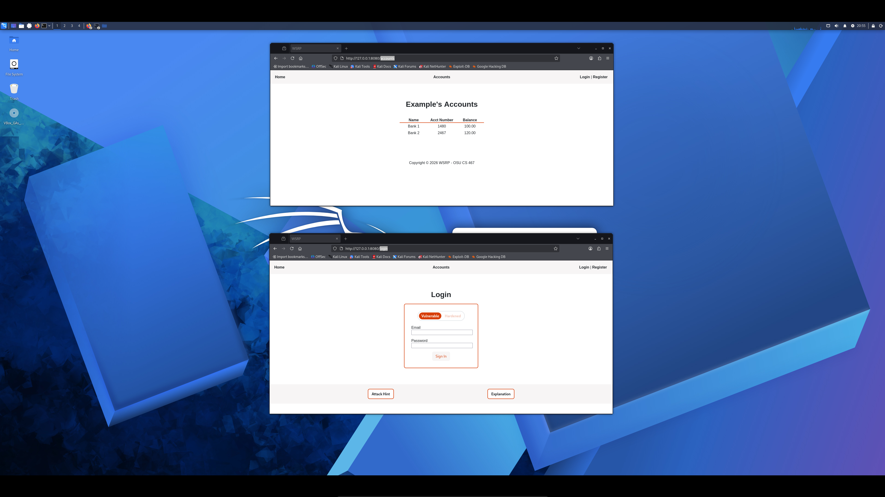

# Authorization Bypass
## Description
This attack uses the URL input `http://127.0.0.1:8080/admin` to access the Admin Accounts page, which contains an input form a user may use to search a user ID (intended use) or perform an SQLi attack (malicious use).

*Note: See SQLi Blind for information on how to attack the Admin Account's user ID input form.*


This attack can be performed when logged in as a customer - as shown in the image above - or even if the user is not logged in, like the image below:


## Code Vulnerability
The navigation links from base.html provide redirects to Admin Accounts if the user is logged in as an admin, otherwise they are redirected to Accounts:
```html

    <a class="navlink" href="{{ url_for('admin.admin') }}">Admin Accounts</a>

    <a class="navlink" href="{{ url_for('account.accounts') }}">Accounts</a>
```
However the admin function in app.py does not check the user's session or role upon redirecting to the link, instead only providing functionality for the user ID input form:
```python
def admin():
    user_id = request.args.get("user_id")
```

## Code Improvement
The admin function is modified so that before user ID requests are processed, it first checks whether the user is logged in, redirecting to the login page if not:
```python
def admin():
    # Check user is logged in
    if "user_id" not in session:
        return redirect(url_for("login.login"))
```
Additionally after checking the login status, it checks the user's role. If the user is not an admin, they are redirected to the Access Denied page:
```python
# Check user role is admin
current_user_id = session.get("user_id")
current_user = db.session.get(User, current_user_id)
if current_user.role.value != "admin":
    return render_template("access_denied.html"), 403

user_id = request.args.get("user_id")
```

## Retesting Result
Only user's that are admins can not access the Admin Accounts page. Users that are not logged in are redirected to the Login page:



If the user is logged in but not an admin, they are instead redirected to the Access Denied page:


