# Brute Force
## Description
*Note: In order to attempt the attack, an assumption is made that the attacker already knows the Administrator's email address:* admin@example.com *.*

*The email address can be retrieved by entering the URL* http://127.0.0.1:8080/admin *(Authorization Bypass), and then inputting the following command into the user id input box (Error-Based SQL Injection):*

`' or ExtractValue(1, concat(':', (SELECT email FROM users WHERE role='admin' LIMIT 1))) or '`

*See Authorization Bypass and Error-Based SQL Injection for more information on these attacks.*

This attack repeatedly enters one or more inputs until a successful login is found. In this case, the program BurpSuite is used to enter a known email, followed by a list of commonly used - and therefore insecure - passwords.

 1. Open BurpSuite, click 'Next' and 'Start Burp'. If a pop-up saying "BurpSuite is out of date" appears, click 'OK' (the version available in the Kali Linux distribution is acceptable for this attack).
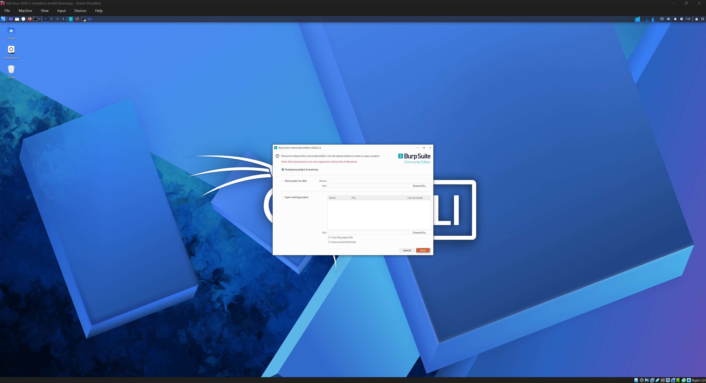
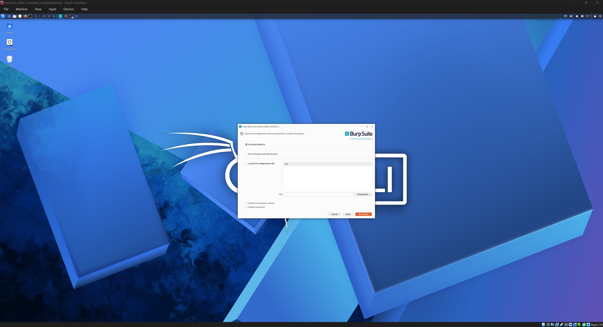
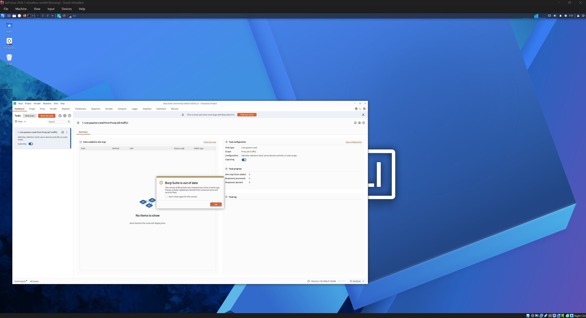
 2. Click the 'Open pre-configured browser' button in the top-right corner of BurpSuite, head to the Login page (http://127.0.0.1:8080/login).
 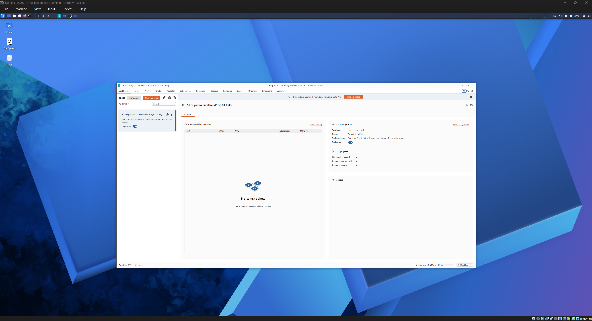
 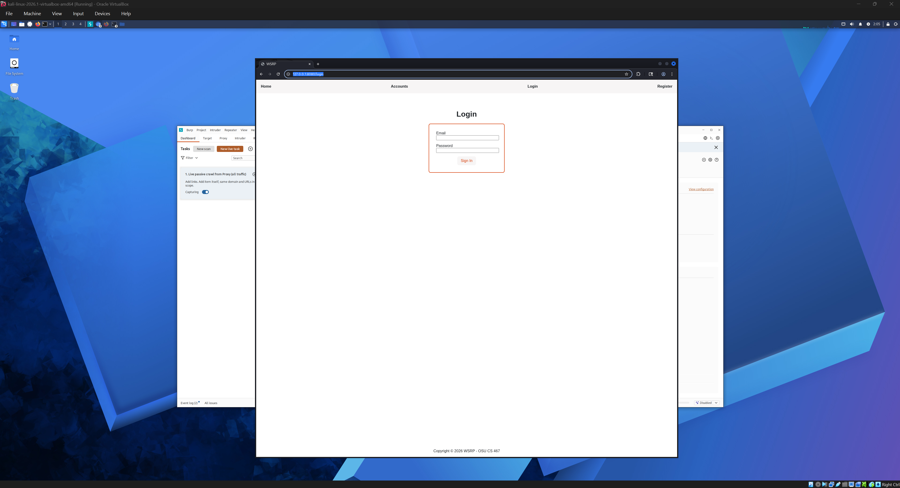
 3. Click on the 'Proxy' tab on BurpSuite, then 'Intercept off' to turn on Intercept; this will intercept any HTTP requests such as GET or POST, which will occur when switching to a different page, clicking buttons, or submitting information in the input boxes.
 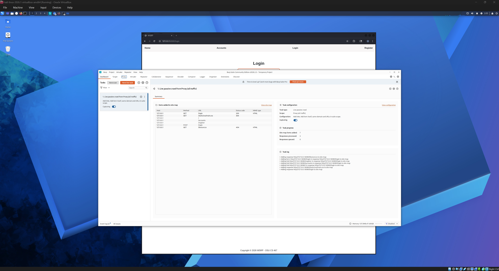
 
 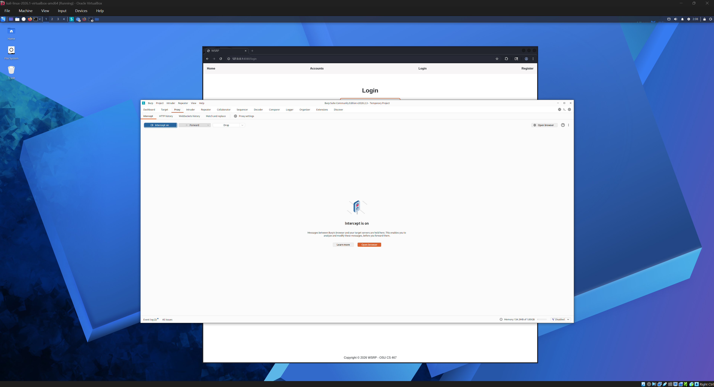
 4. Enter admin@example.com and a random password ("pass" is used in this example), then click 'Sign In'. BurpSuite will intercept this submission. Right-click the interception, then click 'Send to Intruder'.
  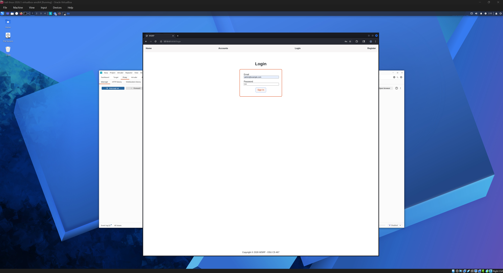
  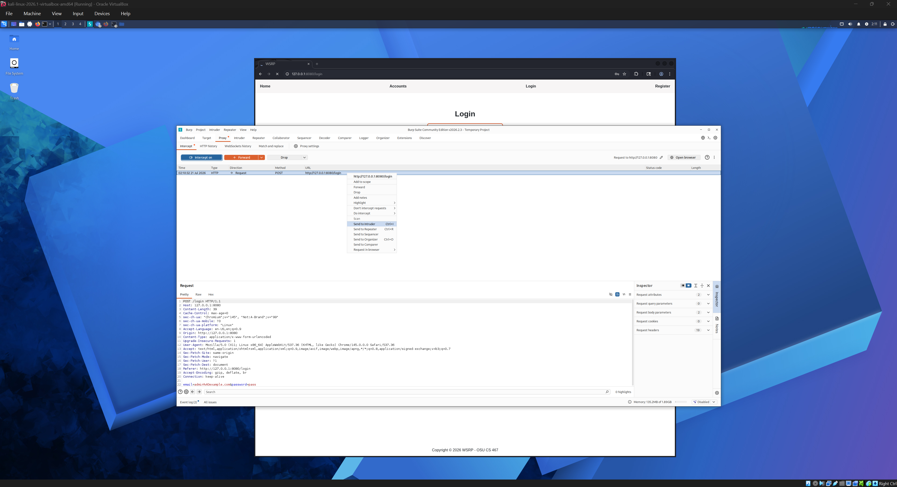
 5. Click on the 'Intruder' tab, delete the word "pass" from Line 22, then click 'Add §'. This should add "§§" next to the line "email=admin%40example.com&password=".
 
  
   
    
 6. Under 'Payload configuration', click 'Load...', select the rockyou.txt wordlist and click 'Open'. This can be found in the Kali Linux distribution in the path /usr/share/wordlists, although the file can also be found [here](https://github.com/RykerWilder/rockyou.txt).
*Note: The file is very large, so opening the file may take a few seconds.*
  
    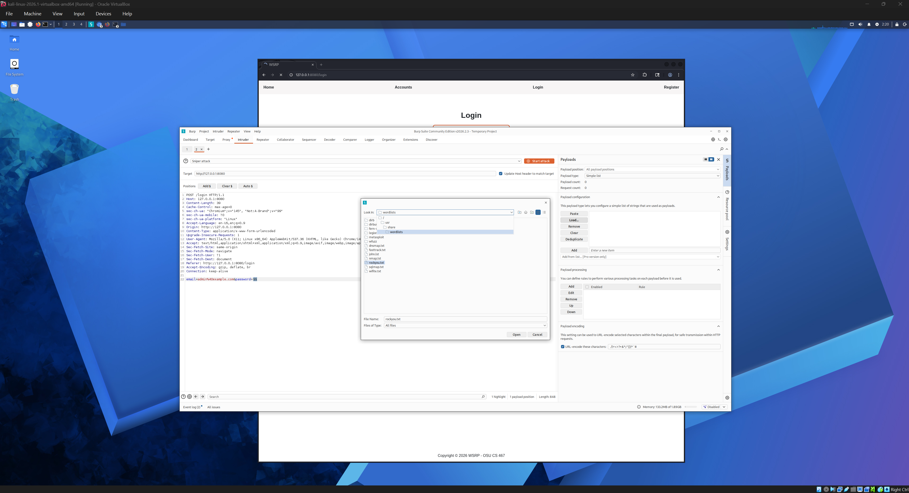
      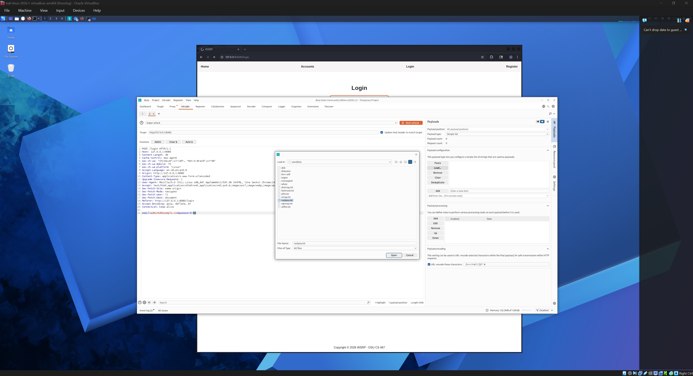
 7. Click 'Start attack'. After a few minutes, a pop-up message saying "Burp Intruder: The Community Edition of Burp Suite contains a demo version of Burp Intruder...". Click 'OK'.
  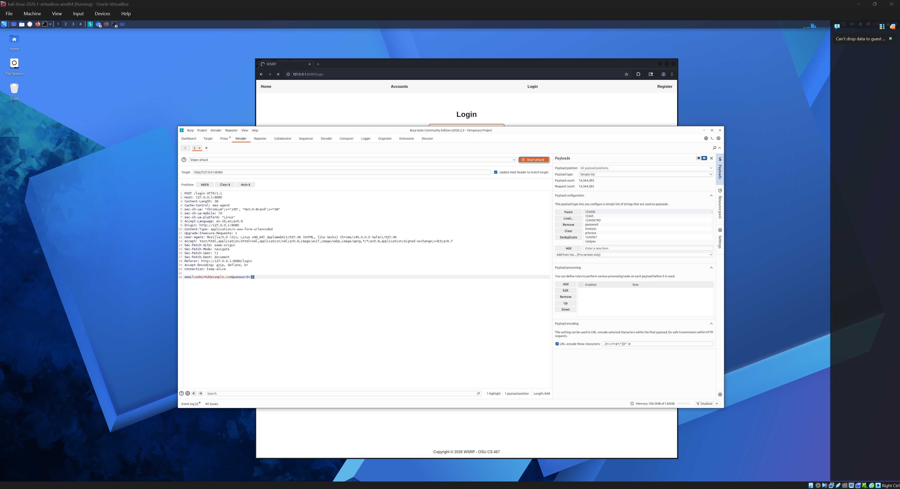
## Result
A page featuring the many attacks performed is shown in the form of requests. Clicking on the column header 'Status Code' will reveal the request "password" with a status code of 302 (a [HTTP 302 Found redirection response](https://developer.mozilla.org/en-US/docs/Web/HTTP/Reference/Status/302)) and a length significantly shorter then the other requests listed. This indicates that the correct password is found.
 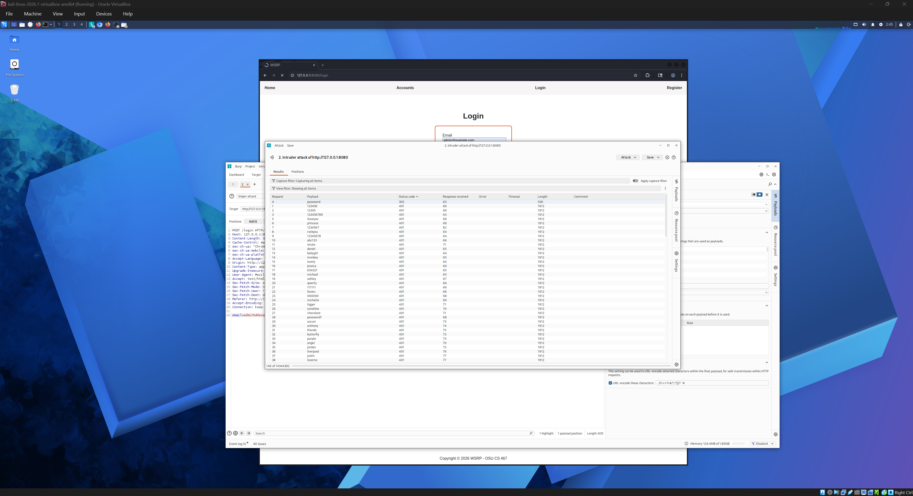
Entering this password with the email address should successfully log in to the Admin Account and redirect to the Admin's Database page.
 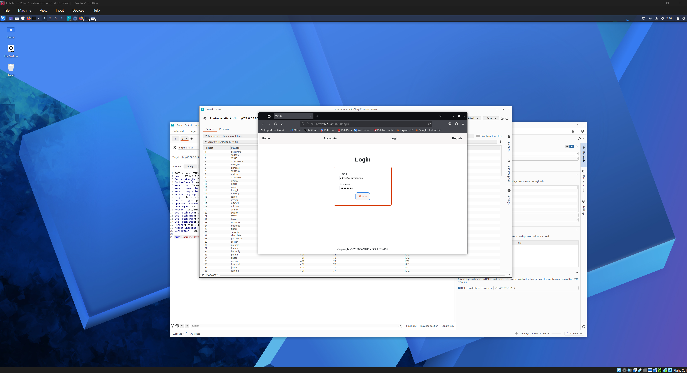
  

## Code Vulnerability
The login authorization checks if the user and password match; if they do not match, the error message "Invalid email or password." appears:
```python
        # Validate password if user exists
        if user and user.check_password(password):
            session["user_id"] = user.id
            session["user_fname"] = user.first_name
            if user.role == UserRole.ADMIN:
                return redirect(url_for('admin'))
            else:
                return redirect(url_for('accounts'))

        return render_template(
            "login.html", error="Invalid email or password."
        ), 401
```
However, there is no penalty for performing unsuccessful logins multiple times. Because of this, a program like BurpSuite can input multiple passwords consecutively until a match is found.

## Code Improvement
The code was modified to include a lockout time of 30 seconds if 3 or more login attempts occur.

If a unsuccessful login is performed, a counter for total_failed_logins is incremented by 1. If the counter reaches 3 or more failed attempts, the lockout timer lockout_time_seconds is set to the current time plus 30 seconds, the remaining time is calculated by the lockout timer minus the current time, and the error message "Too many failed login attempts. Please try again in {remaining} seconds." appears, where {remaining} is the remaining time.

```python
# Unsuccessful login = increment total_failed_logins
        total_failed_logins = session.get("total_failed_logins", 0) + 1
        session["total_failed_logins"] = total_failed_logins
        
        if total_failed_logins >=3:
            session["lockout_time_seconds"] = now + 30
            remaining = session["lockout_time_seconds"] - now
            return render_template(
            "login.html", error=f"Too many failed login attempts. Please try again in {remaining} seconds."
        ), 429
```
The remaining time before the user can login again is checked every subsequent login attempt is made, showing the same error message if the lockout_time is greater than the current time (in other words, if the lockout timer is set).
```python
 # Set lockout time remaining
        now = int(time.time())
        lockout_time = session.get("lockout_time_seconds", 0)

        if lockout_time > now:
            remaining = lockout_time - now
            # HTTP 429 = "Too Many Requests" error
            return render_template(
            "login.html", error=f"Too many failed login attempts. Please try again in {remaining} seconds."
        ), 429
```
When 30 seconds have passed, the failed login count and lockout timer are reset to 0.
```python
        # After 30 seconds, reset lockout timer and failed attempt counter
        if lockout_time > 0 and lockout_time <= now:
            session["total_failed_logins"] = 0
            session["lockout_time_seconds"] = 0
```
Finally if a successful login was performed, then the failed login count and lockout timer are reset to 0.
```python
        # Validate password if user exists
        if user and user.check_password(password):
            session["user_id"] = user.id
            session["user_fname"] = user.first_name
            # Successful login = reset lockout parameters
            session["total_failed_logins"] = 0
            session["lockout_time_seconds"] = 0
```

## Retesting Result
Now when the email and an incorrect password is submitted 3 times, the message "Too many failed login attempts. Please try again in 30 seconds." appears. Even if the correct password is inputted during the lockout, the user cannot log in until the lockout timer expires.
 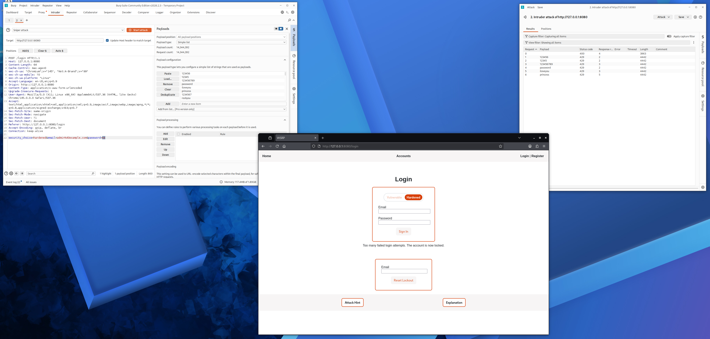
While this example locks out the user for 30 seconds, this value can be increased, greatly hindering an attackers brute force progress.

