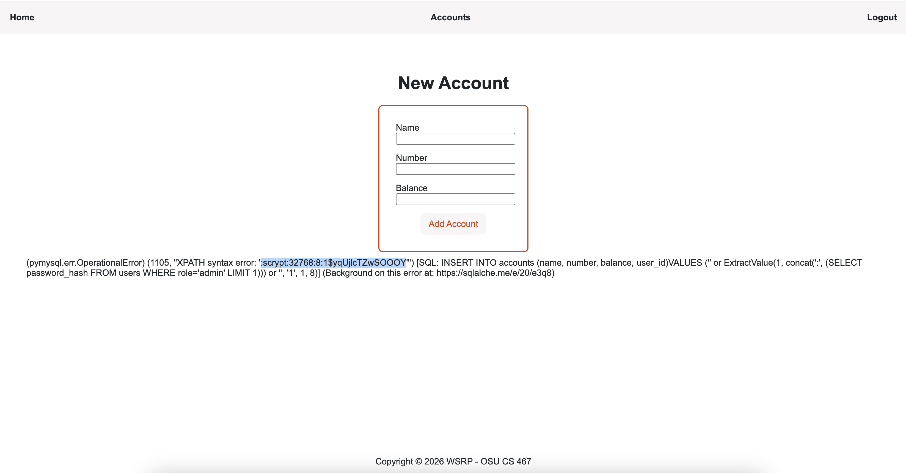
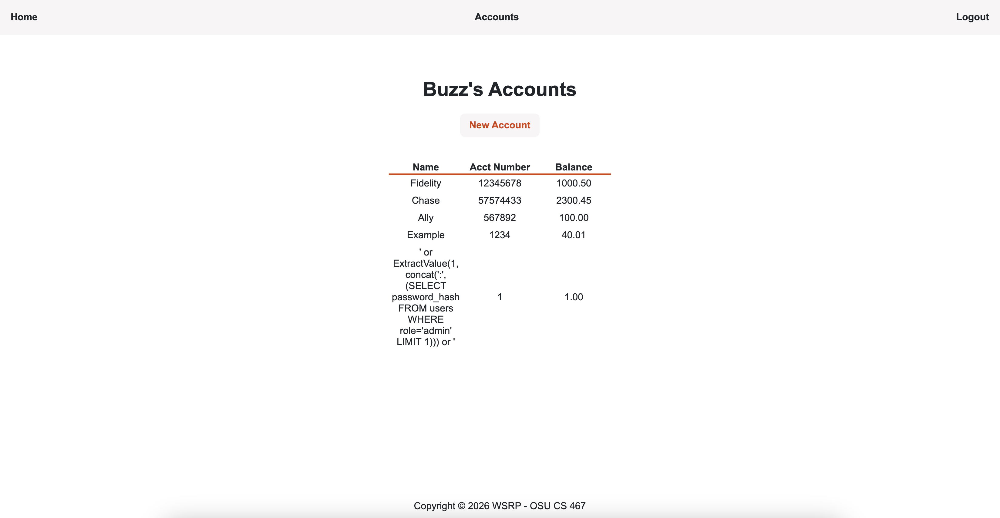
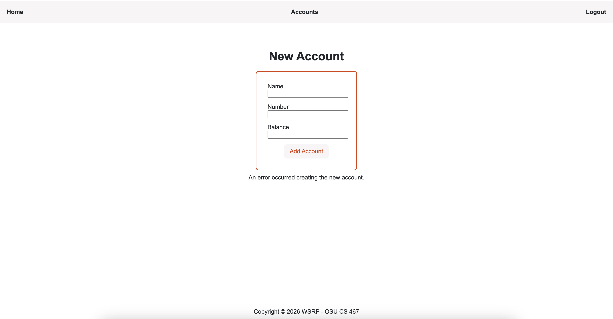

# Error-Based SQL Injection
## Description
This attack uses a text input with an XML function that triggers an error message, which 
then displays sensitive information to the screen. The following value was input in the
'Name' field.

`' or ExtractValue(1, concat(':', (SELECT password_hash FROM users WHERE role='admin' LIMIT 1))) or '`
## Result
The webpage displayed an error message containing the beginning part of the hashed password
for the admin user.


## Code Vulnerability
The raw SQL statement to insert a new account in the database was not properly 
sanitized and directly concatinated, such that the injection was run as code and executed.

```python
stmt = (f"INSERT INTO accounts (name, number, balance, user_id) VALUES ('{name}', '{number}', {balance}, {user_id})")

db.session.execute(text(stmt))
```

Additionally, the code currently displays the raw database error:

```python
except Exception as e:
    db.session.rollback()
    return render_template("new_account.html", error=str(e)), 500`
```
## Code Improvement
The raw SQL statement was modified to a prepared statement using parameterized queries,
such that the form value from the user will be treated as a literal value, including
any injected code.

```python
stmt = (f"INSERT INTO accounts (name, number, balance, user_id) VALUES (:name, :number, :balance, :user_id)")

db.session.execute(text(stmt), {"name": name, "number": number, "balance": balance, "user_id": user_id})
```

Also, the error message was modified to a standard generic message:

```python
except Exception as e:
    db.session.rollback()
    return render_template("new_account.html", error="An error occurred creating the new account."), 500
```
## Retesting Result
The injection is treated as a literal value and not executed as code.



Generic error message is displayed.


