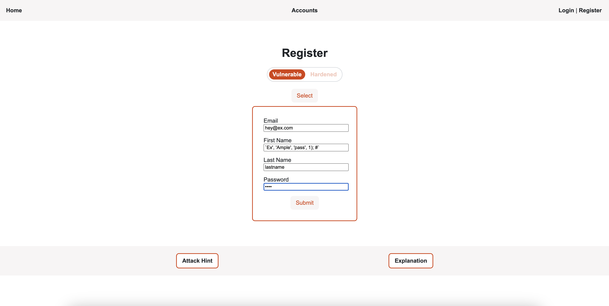
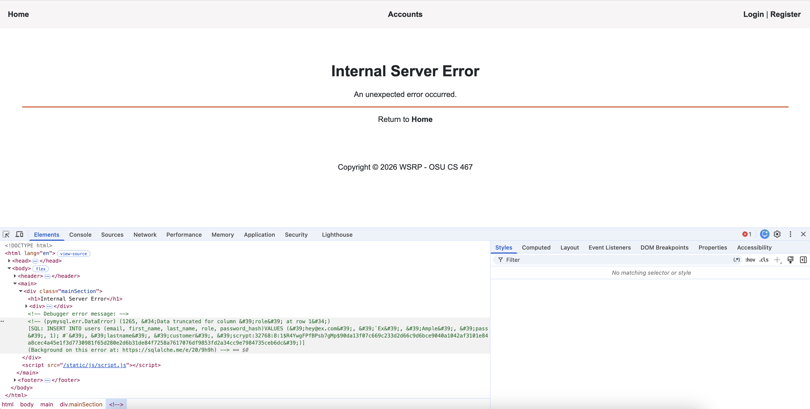
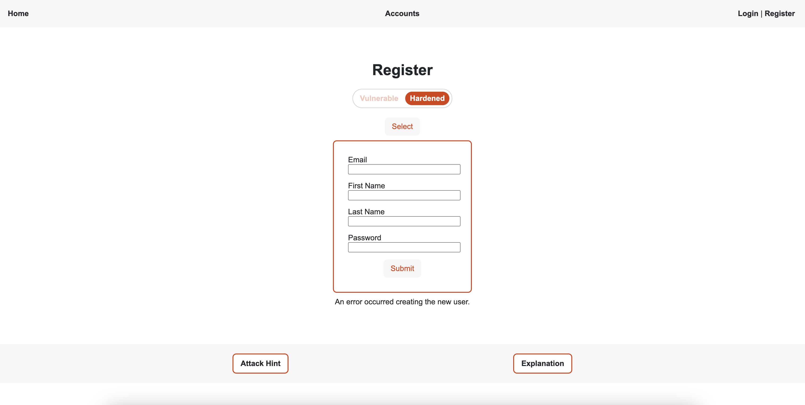

# Mishandled Exception
## Description
This attack purposefully triggers an error that causes an exception to be raised.
Because the exception is not handled by the server, Flask will stop execution
and render its standard error template, which may contain detailed information 
the attacker could then exploit.

This is submitted as the first name input:
`Ex', 'Ample', 'pass', 1); #`


## Result
The input generates an error, since it does not align correctly with the table
attributes. However, Flask renders a standard error template that contains the raw SQL
statement being used to generate the new user. From this, the attacker can learn
the correct values to insert into the database, and that the default user role is
'customer'. Then, the attacker could infer that 'admin' is another role type,
and use that to set up an admin account. Using the following text as the first
name input in vulnerable mode does indeed create an admin account:

`Ex', 'Ample', 'admin', 'pass'); #`


## Code Vulnerability
The vulnerability lies within the route function, which executes assuming no
errors can take place when creating the new user and saving it to the database.

```python
    # Insecure stmt that allows for SQL injection
    stmt = (
        "INSERT INTO users (email, first_name, last_name, role, "
        "password_hash)"
        f"VALUES ('{email}', '{first_name}', '{last_name}', '{role}', "
        f"'{password_hash}')"
    )

    # Insecure code, not in try/except block
    result = db.session.execute(text(stmt))
    db.session.commit()
    # Retrieve newly created user info to set session variables
    new_user_id = result.lastrowid
    user = db.session.get(User, new_user_id)
    session["user_id"] = user.id
    session["user_fname"] = user.first_name
    return redirect(url_for("accounts"))
```

## Code Improvement
The code should be placed in a try/except block. That way, any errors
triggered by saving to the database are caught and properly handled,
without revealing sensitive information about the database.

```python
    # Insecure stmt that allows for SQL injection
    stmt = (
        "INSERT INTO users (email, first_name, last_name, role, "
        "password_hash)"
        f"VALUES ('{email}', '{first_name}', '{last_name}', '{role}', "
        f"'{password_hash}')"
    )
    # Try/except block to gracefully handle any exceptions
    try:
        # Send constructed stmt to database to register user
        result = db.session.execute(text(stmt))
        db.session.commit()
        # Retrieve newly created user info to set session variables
        new_user_id = result.lastrowid
        user = db.session.get(User, new_user_id)
        session["user_id"] = user.id
        session["user_fname"] = user.first_name
        return redirect(url_for("accounts"))
    except BaseException:
        db.session.rollback()
        # Appropriate generic error message is displayed back to user
        return render_template(
            "register.html",
            error="An error occurred creating the new user.",
            security="hardened"
        ), 500
```

## Retesting Result
Now, when an error occurs trying to register the new user, it is caught with 
an appropriate error message displayed.



Note that the detailed error template shown in this example will only
display if the app is being run in debug mode:

```python
if __name__ == "__main__":
    app.run(port=8080, debug=True)
```

Therefore, for this to be a vulnerability in production, the developer would
have to forget to set debug to False.
