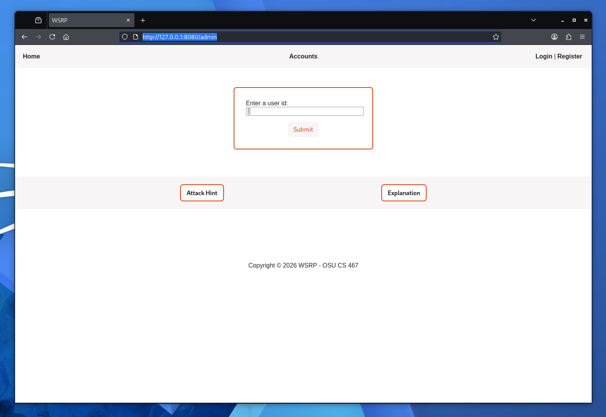
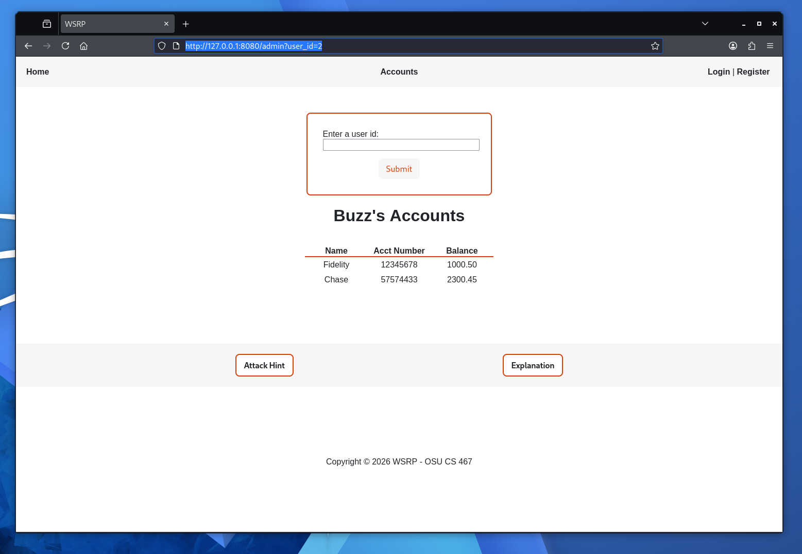
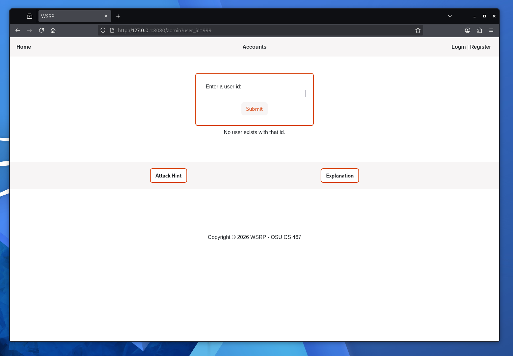
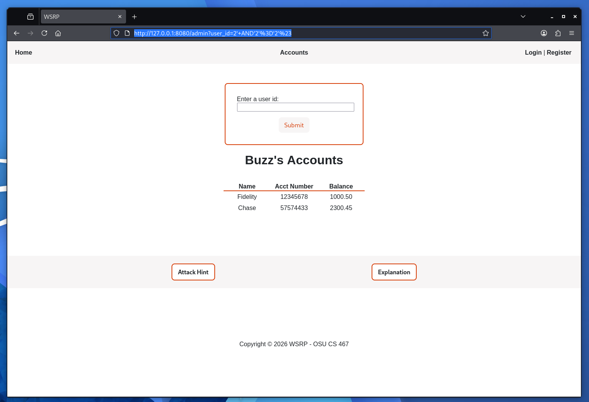
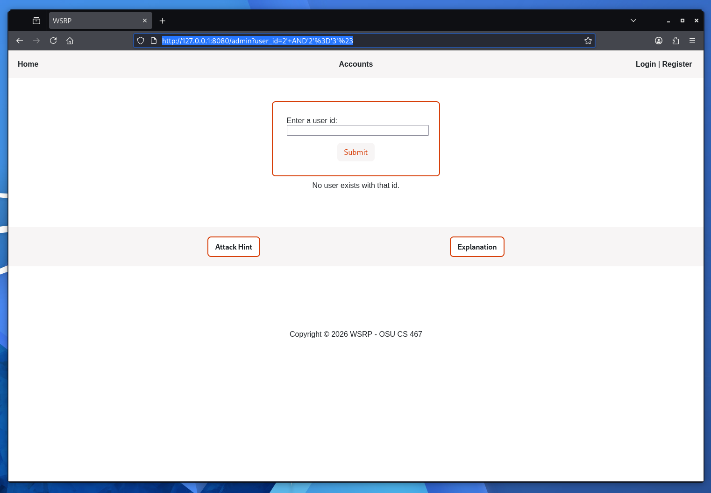
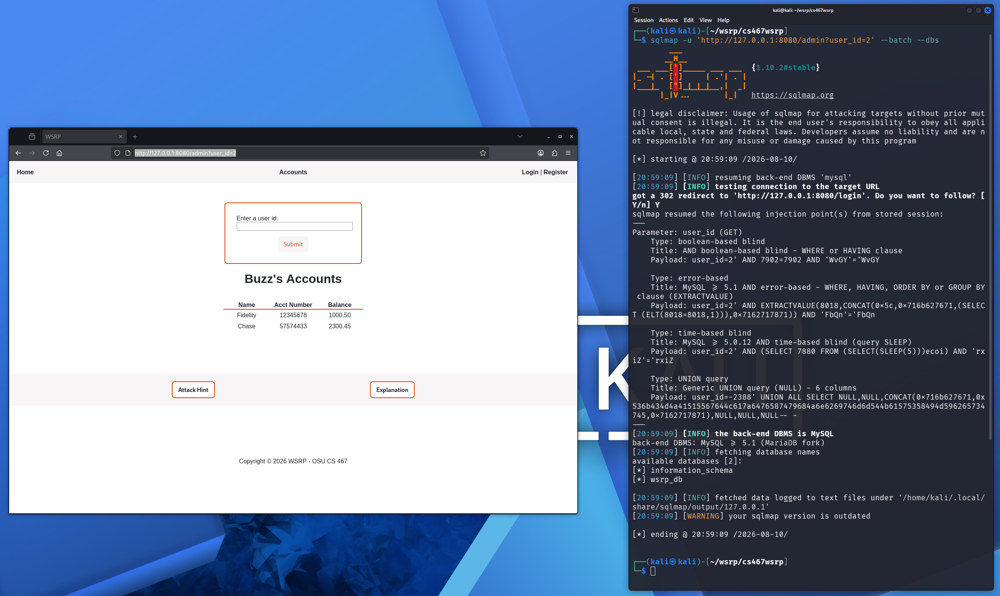
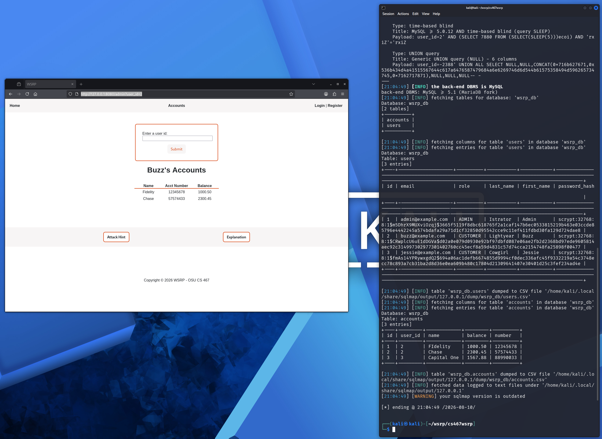
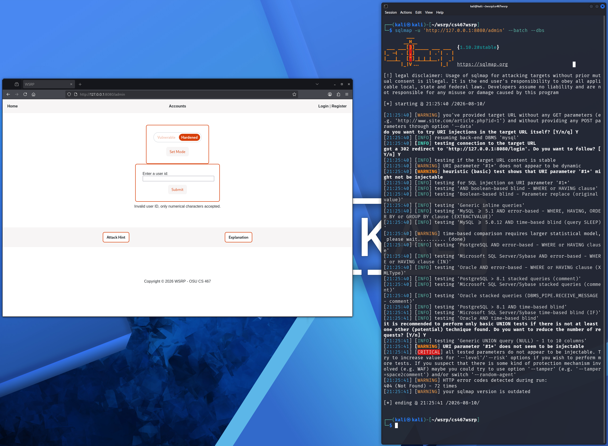

# Blind SQL Injection
## Description
*Note: An assumption is made that either the URL* http://127.0.0.1:8080/admin *has been entered and the web application allows access through vulnerable code (Authorization Bypass), or an attacker has found and used admin user credentials through a previous attack (Brute Force).*

*See [Authorization Bypass](https://github.com/burkeOSU/cs467wsrp/blob/main/docs/README_AuthBypass.md "Authorization Bypass") and [Brute Force](https://github.com/burkeOSU/cs467wsrp/blob/main/docs/README_BruteForce.md "Brute Force") for more information on these attacks.*

This attack uses inputted SQL statements to produce Boolean (yes/no) responses. This can then be used to determine and even map the SQL database structure and its contents.

 1. On the Admin page, the expected usage is to input a user ID number. A valid number (e.g. "2") produces the account information related to said user. An invalid number (e.g. "1" ["1" is designated as the admin, which does not contain customer account information] or "999") instead produces the error message "No user exists with that id."





 2. The inputs can be modified to produce true/false statements depending on the result of the submission. For example, `2' AND'2'='2'#` is always true, so "True" is shown as the ID page for user id 2.  `2' AND'2'='3'#` is always false, so the error message is shown instead.
 
 

 3. The program sqlmap (which is pre-built into the Kali Linux distribution) can then be used to input multiple sql statements repeatedly, only requiring the URL after an input was submitted (in this case, http://127.0.0.1:8080/admin?user_id=2). For example, entering `sqlmap -u 'http://127.0.0.1:8080/admin?user_id=2' --batch --dbs` reveals the name of the database being used by the web application, named "wsrp_db".
 

This name can then be used in the command `sqlmap -u 'http://127.0.0.1:8080/admin?user_id=2' -D wsrp_db --tables --dump --batch` to dump all of the contents of each table in the database, revealing column names and private information such as First and Last Name, Account Numbers, Billing Information and even passwords (which are hashed, although almost all of a user's information can be accessed through this method).
 

## Code Vulnerability
The line responsible for the vulnerability is this one:
```python
stmt = f"SELECT * FROM users WHERE id = '{user_id}'"
```
The line does not discriminate on character length or type, so characters and phrases other than numbers can be entered. `2' AND'2'='2'#` works because it turns the entered statement into `SELECT * FROM users WHERE id = '2' AND'2'='2'#`, effectively appending another clause to the end of the statement through its use of the `'` character.

## Code Improvement
The hardened code provides an if statement that filters out all statements that contain any characters that aren't numerical. These statements instead return the error message "Invalid user ID, only numerical characters accepted."

```python
            if user_id is not None and not user_id.isdigit():
                return (
                    render_template("admin.html", error="Invalid user ID, only numerical characters accepted."),
                    400,
                )
```
The results are no longer Boolean, thanks to the introduction of an invalid result.
## Retesting Result
When any statement other than a numerical value is entered, the error message "Invalid user ID, only numerical characters accepted." appears. The user is redirected to the same page, so the URL cannot be used as part of an sqlmap command. This prevents both manual and tool-based SQLi Blind attacks.
 