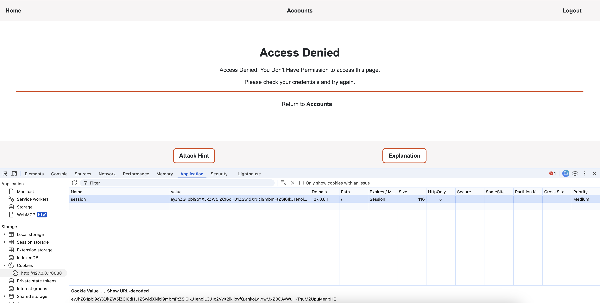
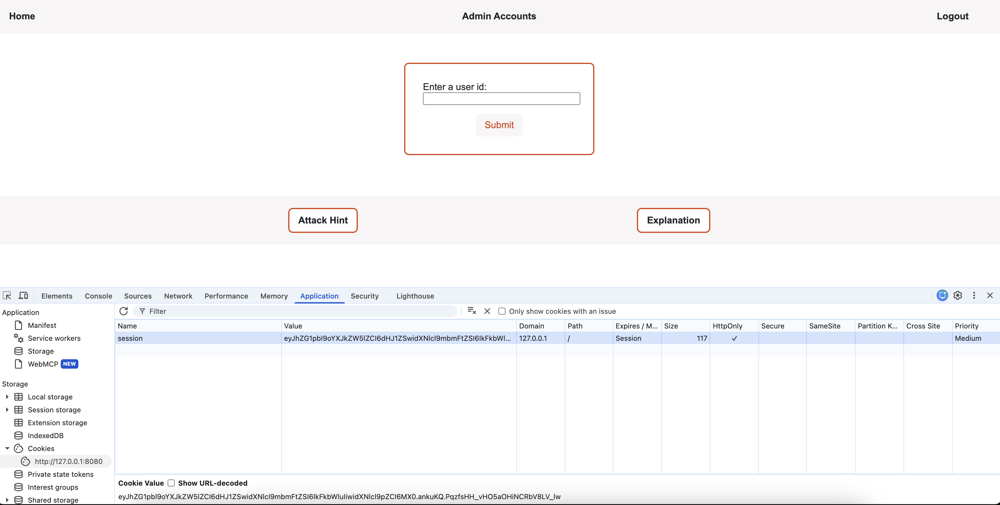

#  Authentication Failure (Session Hijacking)
## Description
This attack occurs when an attacker uses information stored in a user session to
create another session impersonating another user and accessing their data. In this
example, the attacker has knowledge of the secret key used to protect session data
and can use it to generate a session containing another user's credentials.



## Result
Using the new session, the attacker is able to impersonate an admin session and access
the admin page. This is done by base64 decoding the session value to determine what is stored
in the session. 

`eyJhZG1pbl9oYXJkZW5lZCI6dHJ1ZSwidXNlcl9mbmFtZSI6IkJ1enoiLCJ1c2VyX2lkIjoyfQ`

decodes to `{"admin_hardened":true,"user_fname":"Buzz","user_id":2}`

From this, the attacker may infer the user_id of the admin is 1.

Using the secret key, the attacker is able to generate a valid session cookie
using the admin user id. Here is an example of code that can do this:

```python
from flask import Flask
from flask.sessions import SecureCookieSessionInterface

app = Flask(__name__)

app.config["SECRET_KEY"] = "stolen-secret-key"

forged_payload = {"admin_hardened": True, "user_fname": "Admin", "user_id": 1}

serializer = SecureCookieSessionInterface().get_signing_serializer(app)
forged_cookie = serializer.dumps(forged_payload)
```



## Code Vulnerability
The vulnerability that allows the attacker to create a valid new session
lies with the secret key of the Flask app. It could be that the
secret key is not secure enough, with a value such as 'secret-key'. It could
also be that the secret key was exposed in code pushed to a central repository.

## Code Improvement
The secret key should be a strong, randomly generated value. Additionally, it
should be stored in an environment file and imported into the app, ensuring it
is never pushed to a central repository.

```python
app.config["SECRET_KEY"] = os.getenv("SECRET_KEY")
```

## Retesting Result
When the attacker attempts to create a session cookie using an invalid secret key,
Flask will recognize the invalid session and automatically log out the user, clearing
out the session.
