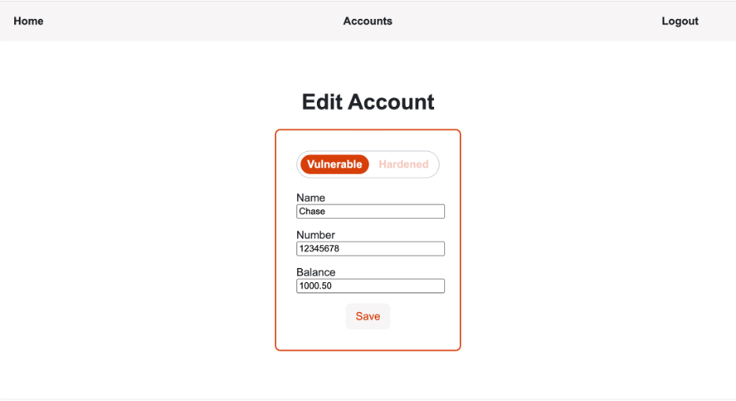
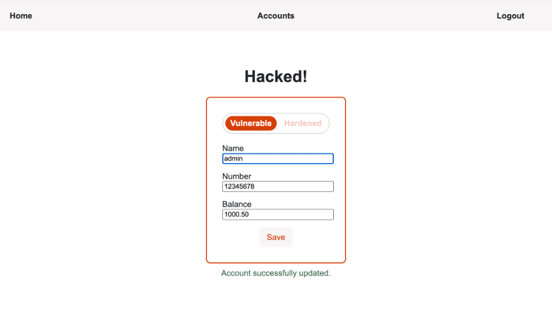
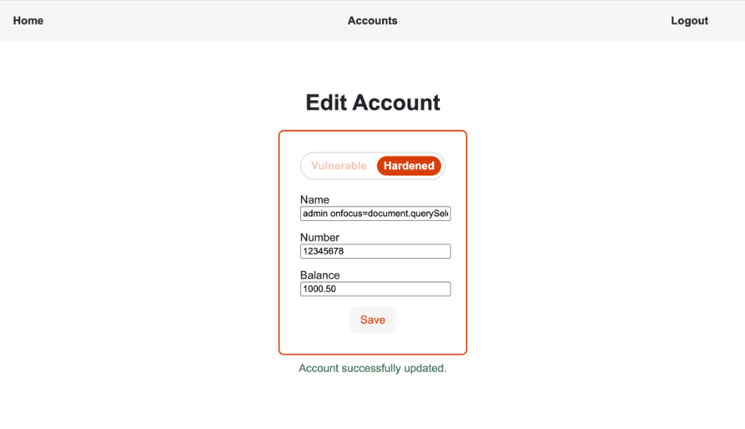

# Stored Cross-Site Scripting
## Description
This attack uses a text input that includes JavaScript, which gets saved to the database
then rendered when incorporated into the html template. The following value was input in the
'Name' field.

`admin onfocus=document.querySelector("h1").innerText="Hacked!" autofocus`


## Result
The webpage is edited to display "Hacked!" as the header in place of the "Edit Account" header
that should be there. You can imagine this could become more involved, such as replacing the
form url to send to an attacker or triggering a pre-defined larger function using an existing
library.


## Code Vulnerability
The vulnerability here is actually in the Jinja2 html template. The database update is secure
but still allows the storage of the attack line as it is plain text. However, the data returned
from the database (acct.name) is rendered in line without quotation marks, which allows the
attacker to add attributes to the input element.

```html
<input type="text" id="name" name="name" value={{ acct.name }} required />
```

## Code Improvement
The Jinja2 html template was modified at the input attribute value, to ensure the data
returned from the database is wrapped on quotations. As you can see, this is a minor edit
that could be easy to miss!

```html
<input type="text" id="name" name="name" value="{{ acct.name }}" required />
```

## Retesting Result
The stored script is treated as a string value and is not executed as code.


